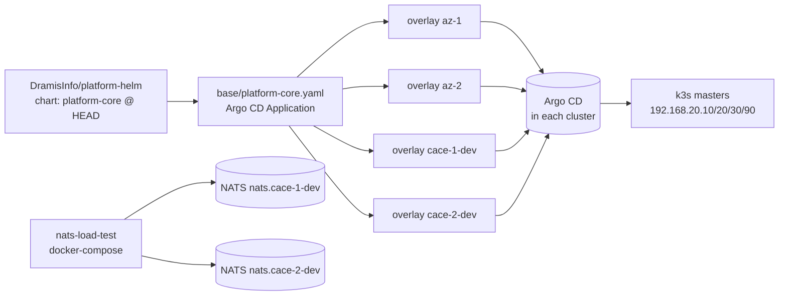

# platform-tools

GitOps overlays for the DramisInfo platform clusters, plus the NATS cross-cluster load-test stack and a few operator scripts that go with them.

[](https://github.com/DramisInfo/platform-tools/commits/main)

## Overview

Per-cluster configuration surface for the `platform-core` Argo CD Application. The repo pins the upstream Helm chart, splits a single `base/` manifest into per-cluster Kustomize overlays, and ships the docker-compose stack used to drive cross-cluster NATS load tests. Argo CD is the only deployment path — nothing here is applied by hand.

## What this repo is

`platform-tools` owns three things:

- The base `platform-core` Argo CD `Application` (`base/platform-core.yaml`), pulling the `platform-core` chart from `DramisInfo/platform-helm` at `targetRevision: HEAD`, with automated prune + selfHeal and `CreateNamespace=true`.
- One Kustomize overlay per target cluster under `overlays/`. Each overlay inherits `../../base` and applies a strategic-merge patch on `spec.source.helm.valuesObject` to set `clusterName`, toggle monitoring / hermesSRE, and configure the NATS gateway.
- A workstation-driven NATS load-test stack (`nats-load-test/` + `nats-cluster-test.sh`) that publishes from `cace-1-dev` and subscribes on `cace-2-dev` to verify cross-cluster message delivery and latency.

`kube.sh` and `ansible/playbook.yml` round it out as shortcuts for pulling a kubeconfig and refreshing every Argo CD `Application` across the four k3s masters.

## Architecture



Argo CD in each cluster reconciles the rendered `Application` against live state; the workstation-side load-test stack talks to the clusters over their public NATS hostnames and is intentionally outside the Argo CD control loop.

## Repository layout

- `base/` — single source of truth for the `platform-core` Argo CD `Application` (chart pin, sync policy, finalizer, `sync-wave: "-100"`).
- `overlays/` — one Kustomize overlay per cluster: `az-1/`, `az-2/`, `cace-1-dev/`, `cace-2-dev/`. `cace-1-dev/` also hosts `teams/team-alpha/` (AppProject + ApplicationSet + Namespace template) and `crossplane-identity.yaml`.
- `nats-load-test/` — docker-compose stack: Fastify `publisher`, NATS `subscriber`, k6 load generator. Each subproject ships its own `package.json` and `Dockerfile`.
- `nats-cluster-test.sh` — wrapper around the compose file with `build | test | status | interactive | down` and env overrides (`VUS`, `DURATION`, `PUBLISHER_REPLICAS`, `SUBSCRIBER_REPLICAS`).
- `kube.sh` — `scp`s the k3s kubeconfig from `192.168.20.10` and merges it as context `k3s-dev1` into `~/.kube/config`.
- `ansible/` — `inventory.ini` lists the four k3s masters; `playbook.yml` refreshes every Argo CD `Application` via `kubectl patch`.
- `.github/agents/`, `.github/prompts/` — repo-local Copilot-style agent specs (`component-manager`, `dashboard`) and the `manage-component` prompt, all scoped to `cace-1-dev`.
- `AGENTS.md` — agent-facing source of truth for layout, conventions, and "what NOT to do".

## Getting started

Prerequisites: `kubectl`, `kustomize`, `docker` (or `docker compose` v2), and optional `ansible` for the cluster refresh play. Argo CD must already be installed in the target cluster with a project named `default`.

Render an overlay to verify the patch lands cleanly:

```bash
kustomize build overlays/cace-1-dev | less
```

Apply a refresh across all four k3s masters:

```bash
ansible-playbook -i ansible/inventory.ini ansible/playbook.yml
```

Pull the dev1 kubeconfig into `~/.kube/config` as context `k3s-dev1`:

```bash
./kube.sh
```

## Usage

The most common task is the cross-cluster NATS load test. The wrapper auto-builds images on first run, then drives the publisher / subscriber / k6 stack end-to-end:

```bash
./nats-cluster-test.sh test
# 10 VUs for 60s, 10 publisher + 10 subscriber replicas by default

VUS=50 DURATION=120s \
  PUBLISHER_REPLICAS=3 SUBSCRIBER_REPLICAS=2 \
  ./nats-cluster-test.sh test
```

For manual probing, `interactive` brings the publisher and subscriber up in the background, tails subscriber logs, and prints the in-container `wget` command for a one-off publish.

## Configuration

The values you'll actually touch live in overlay patches, not Helm values files:

- `overlays/<env>/patches/platform-core.yaml` — strategic-merge patch on `spec.source.helm.valuesObject`. Sets `global.clusterName`, toggles `bootstrap.hermesSre.enabled` / `bootstrap.monitoring.enabled`, and the `bootstrap.nats.gateway` block (advertise URL, peer gateways, enabled flag).
- `overlays/cace-1-dev/patches/crossplane-identity.yaml` — public Azure UMI `clientId` for the Crossplane identity. Safe to commit; rotated via PR by an automated job.
- `nats-load-test/docker-compose.yml` — `NATS_URL`, `SUBJECT`, `STATS_INTERVAL_MS`, `NATS_QUEUE` (empty = fan-out, set = competing consumers), and k6 `VUS` / `DURATION` defaults.
- `ansible/inventory.ini` — list of k3s master IPs that the refresh play targets.

`base/platform-core.yaml` pins `targetRevision: HEAD` on `DramisInfo/platform-helm` deliberately; see AGENTS.md before changing it.

## Related repos

- [home-lab](https://github.com/DramisInfo/home-lab) — Foundational infra and bootstrap orchestration for self-hosted k3s clusters on Proxmox + Azure.
- [platform-tools](https://github.com/DramisInfo/platform-tools) — GitOps overlays for the DramisInfo platform clusters.
- [platform-helm](https://github.com/DramisInfo/platform-helm) — Meta Helm chart (`platform-core`) for Argo CD-driven platform bootstrap.
- [platform-crossplane-compositions](https://github.com/DramisInfo/platform-crossplane-compositions) — Crossplane Compositions (XRDs, compositions, RBAC) for the platform.
- [crossplane-providers-and-functions](https://github.com/DramisInfo/crossplane-providers-and-functions) — Helm chart that installs the Crossplane providers, composition functions, and ProviderConfigs.
- [platform-project-workspaces](https://github.com/DramisInfo/platform-project-workspaces) — Bootstrap manifests for the product-workspaces App-of-Apps pattern and the preview/QAS GitHub repository_dispatch pipeline.
- [platform-standards](https://github.com/DramisInfo/platform-standards) — Canonical schemas and conventions for product workspaces and app repositories.
- [platform-workflows](https://github.com/DramisInfo/platform-workflows) — Reusable GitHub Actions workflows for the DramisInfo org.

## Troubleshooting

- **`kustomize build` fails on an overlay after a base change.** Re-render `kustomize build base` first; every overlay inherits it, so a chart-pinned diff in `base/platform-core.yaml` will surface in all four.
- **Argo CD shows the `platform-core` Application as `OutOfSync` with no diff.** Force a refresh via `ansible/playbook.yml` — the play patches every `Application` with a normal refresh operation.
- **NATS load test never reaches the healthy publisher count.** Check `./nats-cluster-test.sh status` and container logs; usually a stale image — run `./nats-cluster-test.sh build` and retry.
- **JetStream warnings about "no metadata leader".** Confirm the cace-2-dev gateway is **not** re-enabled in `overlays/cace-1-dev/patches/platform-core.yaml` (`bootstrap.nats.gateway.enabled: false`); that cluster was decommissioned on 2026-06-23 and the gateway was blocking RAFT leader election.
- **`kube.sh` fails on `scp`.** The script is hard-coded to `ubuntu@192.168.20.10`; ensure your SSH agent has the matching key and the host is reachable before re-running.

## Security

- Do not commit kubeconfigs, kubeconfig certificates, Argo CD admin passwords, or registry credentials. The `clientId` in `overlays/cace-1-dev/patches/crossplane-identity.yaml` is a public Azure UMI Application (client) ID, not a secret — do not paste the matching secret value here.
- Do not bypass Argo CD with `kubectl apply` from a workstation; use `ansible/playbook.yml` or the Argo CD UI/API.
- Do not move `nats-load-test/` under Argo CD; it is a workstation-driven docker-compose stack talking to clusters over the public NATS hostnames.
- The full guardrail list (chart-version bumps, overlay scope, `targetRevision: HEAD`, repo-root `package.json`, etc.) lives in the "What NOT to do" section of [AGENTS.md](./AGENTS.md).

## Contributing

- Branch from `main` using Conventional Commits names, e.g. `feat/cace-1-dev/<slug>` or `fix/nats/<slug>`.
- Commits follow Conventional Commits — e.g. `feat(cace-1-dev): enable hermes-sre read-only ServiceAccount`, `fix(nats): disable gateway to defunct cace-2-dev cluster`. Automated client-ID rotation commits use the `Update Crossplane UMI client ID ...` prefix and merge via PR.
- Changes land through PRs into `main`. There is no `CONTRIBUTING.md`, `CODE_OF_CONDUCT.md`, or CI workflow in this repo; agent specs in `.github/agents/` are scoped to `cace-1-dev` only.

## License

No license — internal/private project. Do not redistribute without permission from the DramisInfo platform team.

## Changelog

Recent `git log --oneline main` highlights: `feat(cace-1-dev): enable hermes-sre read-only ServiceAccount` (PR #3); `fix(nats): disable gateway to defunct cace-2-dev cluster` on 2026-06-23; Gatekeeper non-root policy exclusion for `it-gitops-enterprise-prd`; and the steady stream of automated Crossplane UMI client-ID rotations for `cace-1-dev` (most recently 2026-08-01).

## Acknowledgments

Part of the DramisInfo platform org. Built on Argo CD, Kustomize, k3s, NATS (with JetStream), and the `platform-core` Helm chart in `DramisInfo/platform-helm`. The cross-cluster load-test stack uses Fastify and k6.
