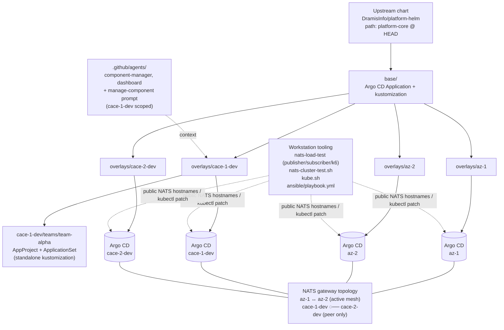

# Architecture

This page describes how the pieces in this repo fit together, from the
upstream Helm chart down to the Argo CD reconciliation loop in each cluster
and the workstation-side NATS load test.

## High-level shape

```
DramisInfo/platform-helm (chart: platform-core @ HEAD)
                  │
                  ▼
       base/platform-core.yaml          ← single Argo CD Application
                  │
       ┌──────────┼──────────┬──────────┐
       ▼          ▼          ▼          ▼
overlays/az-1  overlays/az-2  overlays/  overlays/
                            cace-1-dev cace-2-dev
       │          │          │          │
       ▼          ▼          ▼          ▼
   Argo CD     Argo CD     Argo CD    Argo CD
   in cluster  in cluster  in cluster in cluster
                  │          │
                  │          └──── teams/team-alpha/ (AppProject + AppSet)
                  │
       (workstation, not Argo CD)
                  │
                  ▼
         nats-load-test/ (publisher + subscriber + k6)
                  │
                  ▼
       nats.cace-1-dev   ↔   nats.cace-2-dev
       (publisher)           (subscriber)
```

The base manifest is one `Application`. Each overlay is a thin patch on top.
Argo CD reconciles the rendered output in each cluster. The NATS load test
runs on a workstation and talks to the clusters over their public NATS
hostnames — it is intentionally outside the Argo CD control loop.

## The base `Application`

`base/platform-core.yaml` is the only place that pins the upstream chart:

- `repoURL`: `https://github.com/DramisInfo/platform-helm.git`
- `targetRevision: "HEAD"` — deliberate; not a tag.
- `path: platform-core` — the chart path inside the upstream repo.
- `project: default` — the Argo CD AppProject that already exists in each
  cluster.
- `destination.namespace: test-helm`,
  `destination.server: https://kubernetes.default.svc` — in-cluster.
- `syncPolicy.automated.prune: true`, `selfHeal: true`.
- `syncPolicy.syncOptions`:
  - `CreateNamespace=true`
  - `SkipDryRunOnMissingResource=true`
  - `Validate=false`
  - `Prune=true`
- `metadata.annotations."argocd.argoproj.io/sync-wave": "-100"` — reconciles
  before anything that depends on `platform-core`.
- `metadata.finalizers: ["resources-finalizer.argocd.argoproj.io"]` — so Argo
  CD can clean up resources on delete.

`base/kustomization.yaml` is a one-line wrapper that lists this manifest.
Every overlay inherits `../../base`.

## Overlays

Each overlay is a Kustomize `Kustomization` that:

1. Inherits `../../base` under `resources:`.
2. Sets `commonLabels.environment` (`dev` for `az-1`, `az-2`, `cace-1-dev`;
   `staging` for `cace-2-dev`).
3. Applies `patches/platform-core.yaml` (strategic-merge on
   `spec.source.helm.valuesObject`).
4. For `cace-1-dev` and `cace-2-dev`, additionally applies
   `patches/crossplane-identity.yaml` to inject the public Azure UMI
   `clientId` under `bootstrap.crossplane.workloadIdentity.clientId`.

The patch target is always `kind: Application, name: platform-core`; only
`spec.source.helm.valuesObject` and (rarely) `syncPolicy` are overridden.

### What each overlay sets

- **`az-1`** — `global.clusterName: az-1`, NATS gateway enabled and pointing
  at `az-2-cluster` (`nats://nats.az-2.dramisinfo.com:7222`).
- **`az-2`** — mirror of `az-1`, pointing back at `az-1-cluster`.
- **`cace-1-dev`** — `global.clusterName: cace-1-dev`, `hermesSre.enabled:
  true`, `monitoring.enabled: false`, gatekeeper `excludedNamespaces`
  populated (`kube-system`, `gatekeeper-system`, `cert-manager`,
  `istio-system`, `argocd`, `azure-arc`, `it-gitops-enterprise-prd`),
  `bootstrap.argocd.smeeUrl` set, NATS gateway **disabled**.
- **`cace-2-dev`** — `global.clusterName: cace-2-dev`,
  `monitoring.enabled: true`, NATS gateway enabled and pointing at
  `cace-1-dev-cluster` (`nats://nats.cace-1-dev.dramisinfo.com:7222`).

The `cace-1-dev` `bootstrap.nats.gateway` block carries an inline comment
explaining the 2026-06-23 decision to leave it disabled after `cace-2-dev`
was decommissioned.

### `teams/team-alpha/`

`overlays/cace-1-dev/teams/team-alpha/` is a standalone kustomization that
defines:

- An `AppProject` (`team-alpha`) restricting destinations to
  `team-alpha-*` namespaces plus `kube-system`.
- An `ApplicationSet` (`team-alpha-apps`) that scans
  `app-teams/team-alpha/cace-1-dev/*` in this same repo and renders one
  `Application` per directory.
- A `Namespace` template (in `namespaces.yaml`).

It is not yet listed under `cace-1-dev/kustomization.yaml`'s `resources:`
— its own `kustomization.yaml` is the entry point. The scanned path
(`app-teams/team-alpha/cace-1-dev/*`) does not exist in the tree yet, so the
generator currently produces nothing.

## Argo CD reconciliation

Each rendered `Application` carries:

- `sync-wave: "-100"` — reconciles before any other Application.
- The `resources-finalizer.argocd.argoproj.io` finalizer.
- `automated.prune: true`, `automated.selfHeal: true`.

Argo CD pulls `DramisInfo/platform-helm` at `HEAD`, renders the chart with
the overlay-supplied `valuesObject`, and reconciles the result against live
cluster state. Drift is corrected automatically; failures are retried with
the backoff schedule in `syncPolicy.retry`.

## NATS load-test stack

`nats-load-test/docker-compose.yml` defines three services:

- `publisher` (Fastify, Node 22) — `POST /publish` on port 3000, forwards
  each request as a NATS message to `nats.cace-1-dev.dramisinfo.com:4222` on
  subject `loadtest.cross`. Has a Docker healthcheck on `GET /health`.
- `subscriber` — connects to `nats.cace-2-dev.dramisinfo.com:4222`,
  subscribes to `loadtest.cross`, logs throughput + cross-cluster latency
  every `STATS_INTERVAL_MS` (default 2000 ms). `NATS_QUEUE` empty =
  fan-out; set = competing consumers.
- `k6` — uses the grafana/k6 image; `VUS` virtual users hit the publisher
  via `http://publisher:3000` for `DURATION` (defaults: 10 VUs / 60s).

`nats-cluster-test.sh` wraps the compose file with `build | test | status |
interactive | down` and reads env overrides (`VUS`, `DURATION`,
`PUBLISHER_REPLICAS`, `SUBSCRIBER_REPLICAS`). It auto-builds the images if
they are missing before running `test` or `interactive`.

The stack is workstation-driven: it talks to the clusters over the public
NATS hostnames, not via in-cluster service discovery. Do not move it under
Argo CD.

## Operator scripts

- `kube.sh` — `scp ubuntu@192.168.20.10:/etc/rancher/k3s/k3s.yaml
  ~/.kube/k3s-dev1-config`, rewrites `127.0.0.1` → `192.168.20.10`, renames
  the default context/cluster/user to `k3s-dev1`, then flattens the result
  into `~/.kube/config` (backing up the existing config first).
- `ansible/playbook.yml` — runs against the `master` group in
  `ansible/inventory.ini` (the four k3s masters at `192.168.20.10`, `.20`,
  `.30`, `.90`). For each Argo CD `Application` in the `argocd` namespace,
  it runs `kubectl patch application ... -p '{"operation":{"refresh":
  "normal",...}}'`. Uses `KUBECONFIG: /etc/rancher/k3s/k3s.yaml`.

## Agent specs

`.github/agents/component-manager.agent.md` and
`.github/agents/dashboard.agent.md` are repo-local Copilot-style specs, both
explicitly scoped to `cace-1-dev`. The
`.github/prompts/manage-component.prompt.md` prompt wires the
`component-manager` agent. They are convenience wrappers, not a deployment
mechanism.

## Component summary

The blocks above are slices of one repo. The diagram below ties the
components together: the upstream Helm chart, the base + four overlays, the
`team-alpha` sub-kustomization, Argo CD in each of the four clusters, the
NATS gateway mesh, the workstation tooling that drives the load test and
the Argo CD refresh, and the repo-local agent specs.



Solid arrows are GitOps reconciliation (chart → base → overlays → Argo CD
per cluster, plus the `team-alpha` sub-kustomization off `cace-1-dev`).
Unbroken links into `nats_gw` show every cluster that participates in the
declared gateway mesh; the live state is annotated on the node itself. The
dashed workstation edges cover both the NATS load test (talking to the
cace clusters over their public hostnames) and `ansible/playbook.yml`
pushing a `refresh` operation into every cluster's Argo CD. The dashed
`agents` edge is purely a context relationship — the agent specs read
`overlays/cace-1-dev` and do not deploy anything.
